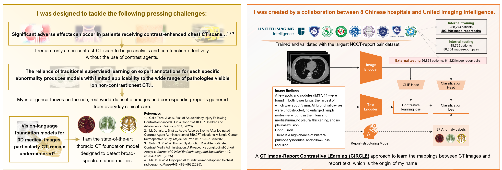
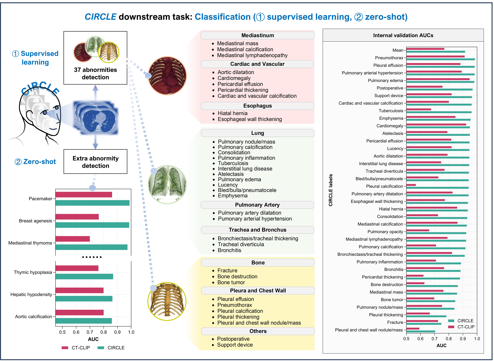
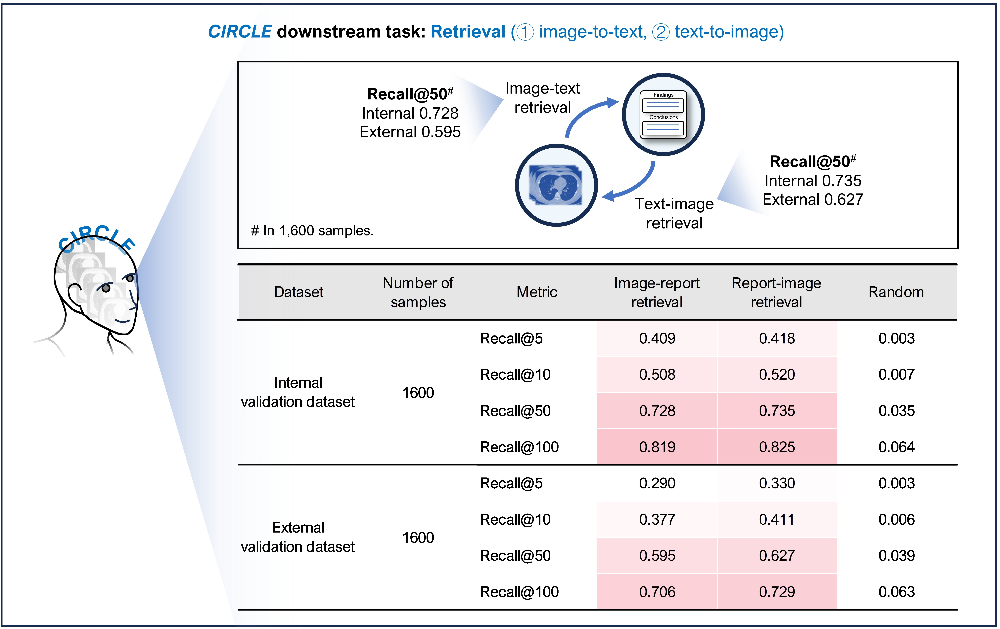
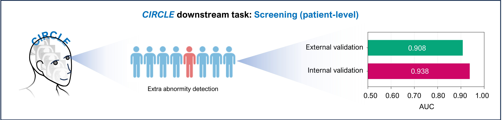

# CIRCLE


<p align="center">
    
<p>

<p align="center">
        🔥 <a href="https://huggingface.co/datasets/uii-open-source/CIRCLE-ZS2K">CIRCLE Dataset</a>&nbsp&nbsp | &nbsp&nbsp🤗 <a href="https://huggingface.co/xxx">CIRCLE Model</a>&nbsp&nbsp | &nbsp&nbsp📑 Paper is coming</a>&nbsp&nbsp
</p>

## Introduction

A comprehensive introduction of CIRCLE, a state-of-the-art (SOTA) thoracic CT foundation model. 

Developed through a collaboration between eight Chinese hospitals and United Imaging Intelligence (UII), CIRCLE is presented as the first clinically validated model designed for broad-spectrum abnormality detection exclusively on non-contrast chest CT scans.

#### Key Attributes:

* **Large-scale Dataset**: The model is created to address the limitations of contrast-enhanced CT and traditional supervised learning, leveraging **~400,000  real-world clinical image-report pairs**. ​​
* **Unsurpervised Image-report Alignment**:​​ The core architecture is based on a vision-language pre-training approach that uses contrastive learning to align CT image features with corresponding radiology report text. ​
* **SOTA Performance**:​ CIRCLE demonstrates high competence in automatically extracting labels for 37 abnormalities from unstructured reports (F1-score: 0.99) and achieves state-of-the-art performance in population-level screening (Image-wise Volume-wise Curve - Area Under the Curve, IVC-AUC: 0.938). 
* **Clinical Validation**:​​ Clinical validation shows that CIRCLE effectively collaborates with radiology residents, reducing diagnostic errors and improving reading efficiency.
<p align="center">
  
</p>

## News
* 2025.10.11: We have released the [**CIRCLE model**](https://huggingface.co/xxx) (Both image and text encoder) and the partial data [**CIRCLE Dataset**](https://huggingface.co/datasets/uii-open-source/CIRCLE-ZS2K). Enjoy it!
* 2025.9.28: We have released the official PyTorch implementation for the CIRCLE foundation model.
* 2025.7.28: We introduce the CIRCLE model to the world. The CIRCLE model made its debut at [**the 8th World Artificial Intelligence Conference (WAIC 2025, Shanghai)**](https://wallstreetcn.com/articles/3751978), where it was recognized for its strong generalization, diagnostic accuracy, and potential to enhance human–AI collaboration in CT interpretation.


## Hardware Requirements
The following hardware configuration is recommended for running the open-source code:
| Component                        | Model / Specification                             |
| -------------------------------- | ------------------------------------------------- |
| **CPU**                          | Intel® Xeon® Platinum 8358 or equivalent          |
| **Memory**                       | DDR4, 1 TB or higher                              |
| **System Disk**                  | 480 GB × 2 NVMe SSD (total 960 GB)                |
| **GPU**                          | NVIDIA L40S × 8                                   |

<!-- | **Data Disk**                    | over 100 TB NVMe SSD            | -->


The system is Ubuntu 22.04 LTS, with NVIDIA driver version 535.154.05 and CUDA version 12.2 installed.

## <span id="Dataset">Dataset</span>
To facilitate future research and promote community progress in CT foundation modeling, we will make part of our CT image–report paired dataset publicly available. We randomly select 2,000 cases from our internal validation set for open release, including both images and their corresponding reports (CIRCLE-ZS2K dataset), which can be publicly accessed via 🤗 [Hugging Face](https://huggingface.co/datasets/uii-open-source/CIRCLE-ZS2K). 

The CIRCLE-ZS2K dataset is an example dataset associated with a related publication currently under submission. We plan to release a larger-scale version in the future, contingent upon obtaining additional ethical approvals and administrative permissions.

The CIRCLE collaborators place the highest priority on protecting patient privacy and interests. All personally identifiable information has been thoroughly anonymized.
At this stage, researchers must contact the CIRCLE collaborators prior to any academic publication based on this dataset. The use of the CIRCLE-ZS2K dataset for any commercial purposes is strictly prohibited.

The CIRCLE-ZS2K dataset contains two folders, and the details are shown as follows:
```
├── CIRCLE-ZS2K
│   ├── image
│   │    ├── 0001
│   │    │    ├── CT.nii.gz
│   │    ├── 0002
│   │    │    ├── CT.nii.gz
│   │    ├── ...
│   ├── label
│   │    ├── lung_center.csv
│   │    ├── CIRCLE_chest37.csv
│   │    ├── CIRCLE_chest10.csv
│   │    ├── CIRCLE_chest_screening.csv
│   ├── report
│   │    ├── report.csv
```
`CIRCLE-ZS2K/image/...` contains 2,000 sample CT scans in each subdirectory, numbered from 0001 to 2000. Each case includes a non-contrast CT image stored in the NIfTI format (CT.nii.gz). 

`lung_center.csv` contains four columns:

- The first column is the image name.

- The next three columns represent the x, y, and z world coordinates of the crop center.
In our experiments, the crop center corresponds to the center of the lungs.

`CIRCLE_chest37.csv` contains 38 columns:

- The first column is the image name.

- The next 37 columns correspond to the labels of 37 thoracic abnormalities, which were automatically extracted from reports using our proposed CIRCLE-labeler. A value of 1 indicates a positive finding, while 0 indicates a negative finding.

`CIRCLE_chest10.csv` contains 11 columns:

- The first column is the image name.

- The next 10 columns correspond to the labels of 10 abnormalities in downstream tasks, which were automatically extracted from reports using our proposed CIRCLE-labeler. A value of 1 indicates a positive finding, while 0 indicates a negative finding.
  
`CIRCLE_chest_screening.csv` contains 2 columns:

- The first column is the image name.

- The next column correspond to the labels of abnormal patients, which were automatically extracted from reports using our proposed CIRCLE-labeler. A value of 1 indicates a positive finding, while 0 indicates a negative finding.

The file `report.csv` contains structured radiology report information with three columns:
| **Column**       | **Description**                                                                                                                                                   |
| ---------------- | ----------------------------------------------------------------------------------------------------------------------------------------------------------------- |
| **`image_name`** | Identifies each case by its corresponding number *(1–2000)*.                                                                                                      |
| **`finding`**    | Describes the imaging observations in **Chinese**, including anatomical and pathological findings from non-contrast CT scans, as reviewed by senior radiologists. |
| **`impression`** | Provides the **diagnostic conclusion** in Chinese, validated by senior radiologists.                                                                              |

Here, we provide an example report（*Index 0002*）from the open-source dataset, including both the findings and impression, along with their English translations.
| Field          | Chinese                                                                                                          | English Translation                                                                                                                                                                                                                                                                                                                                                                                                                                                                                                                                                                                             |
| -------------- | ---------------------------------------------------------------------------------------------------------------- | --------------------------------------------------------------------------------------------------------------------------------------------------------------------------------------------------------------------------------------------------------------------------------------------------------------------------------------------------------------------------------------------------------------------------------------------------------------------------------------------------------------------------------------------------------------------------------------------------------------- |
| **Finding**    | 左上肺舌段见类圆形肿块影，大小约65×56mm，增强后边缘强化为主，中心坏死无明显强化，病灶周围见斑片模糊影及条片状实变影；两肺少许斑点条索影，左下肺少许实变影，所见各支气管腔通畅，纵隔见轻度肿大淋巴结，左侧胸腔内少量积液。 | A round-like mass measuring approximately 65 × 56 mm is observed in the lingular segment of the left upper lobe. Post-contrast imaging shows predominantly peripheral enhancement with central necrosis demonstrating no significant enhancement. Patchy opacities and streaky consolidation are seen around the lesion. A few spotted and streaky shadows are noted in both lungs, along with areas of consolidation in the left lower lobe. The bronchial airways are patent. Mildly enlarged lymph nodes are present in the mediastinum, accompanied by a small amount of pleural effusion on the left side. |
| **Impression** | 左上肺MT伴阻塞性炎症及不张，左侧少量胸腔积液；两肺少许慢性炎症陈旧灶，左下肺少许节段性不张。                                                                  | Malignant tumor in the left upper lobe with obstructive inflammation and atelectasis; left-sided small pleural effusion; few chronic inflammatory and fibrotic changes in both lungs; segmental atelectasis in the left lower lobe.                                                                                                                                                                     

## Code Structure
- `figures/`: figures in README.
- `model/`: main CIRCLE model combining image and text encoders for multi-modal learning.
- `train/`: training codes for CIRCLE model.
- `test/`: evaluation reproduction codes for CIRCLE model.

## Installation
Clone this repo.
```bash
git clone https://github.com/uii-open-source/CIRCLE
cd CIRCLE/
```
Please install dependencies (e.g., pytorch, transformers) by
```bash
pip install -r requirements.txt
```
The specific types and versions of the required software can be found in the `requirements.txt` file. 


## Training
### Model Preparation
Before starting the training, you need to prepare the text encoder used in CIRCLE.
1. Using a Pre-trained Chinese RoBERTa Model

In our training, we used the open-source RoBERTa Chinese Base model as the initialization for the text encoder.
You can download the model weights from ModelScope:

👉 https://www.modelscope.cn/models/iic/nlp_roberta_backbone_base_std

2. (Optional) Using the CIRCLE Text Model

Alternatively, you can use the CIRCLE text encoder as initialization to further train on your own dataset.
The CIRCLE text model has been pre-trained on over 400,000 radiology reports, which typically provides better performance for continued training (fine-tuning) on other medical datasets.

3. Updating the Training Script

After downloading the model weights, update the paths in
`train/train_circle.py`
to point to your local `nlp_roberta_backbone_base_std` folder.
```bash
# Initialize the BERT tokenizer from a pre-trained model path
# The tokenizer converts report text (description + conclusion) into token IDs
tokenizer = BertTokenizer.from_pretrained('/path/to/circle/text_model/nlp_roberta_backbone_base_std')

# Initialize the BERT model from the same pre-trained path
# The model outputs contextualized embeddings for input tokens
text_encoder = BertModel.from_pretrained("/path/to/circle/text_model/nlp_roberta_backbone_base_std")
```
> 🔧 Replace `/path/to/circle/text_model/nlp_roberta_backbone_base_std`
with the actual path to your local `nlp_roberta_backbone_base_std` directory.

### Dataset Preparation
If you are using **our open-source CIRCLE-ZS2K dataset**, simply download it to your local machine and update the dataset paths in the training script
`train/train_circle.py` as follows:
```bash
trainer = CIRCLETrainer(
    circle_model,                              # the CIRCLE model instance
    tokenizer,                                 # tokenizer for processing text inputs
    data_folder='/path/to/image',                      # folder containing all patient CT data
    label_csv='/path/to/label/label.csv',                    # CSV file mapping image names to labels
    lung_center_csv='/path/to/label/lung_center.csv',        # CSV file with lung center coordinates for cropping
    report_csv='/path/to/report/report.csv',                  # CSV file containing report text for each image
    num_train_steps=200001,                    # total number of training steps
    batch_size=5,                              # batch size for training
    results_folder="/path/to/results",                 # folder to save training outputs and checkpoints
    num_workers=6,                             # number of data loader workers for parallel loading
    save_results_every=1000,                   # frequency (in steps) to save intermediate results
    save_model_every=1000                      # frequency (in steps) to save model checkpoints
)

```
> 🔧 Replace `/path/to/image`, `/path/to/report`, and `/path/to/label`
with the corresponding subfolders in your locally downloaded CIRCLE-ZS2K dataset.

If you are using your own dataset, please make sure to prepare the training data in the same structure and format as the CIRCLE-ZS2K dataset.
A detailed description of the required data format can be found in the [Dataset](#Dataset) section of this README.

### Training Script
First, specify the paths for saving trained model checkpoints and output results in the training script `train/train_circle.py`:
```bash
trainer = CIRCLETrainer(
    circle_model,                              # the CIRCLE model instance
    tokenizer,                                 # tokenizer for processing text inputs
    data_folder='/path/to/image',                      # folder containing all patient CT data
    label_csv='/path/to/label/label.csv',                    # CSV file mapping image names to labels
    lung_center_csv='/path/to/label/lung_center.csv',        # CSV file with lung center coordinates for cropping
    report_csv='/path/to/report/report.csv',                  # CSV file containing report text for each image
    num_train_steps=200001,                    # total number of training steps
    batch_size=5,                              # batch size for training
    results_folder="/path/to/results",                 # folder to save training outputs and checkpoints
    num_workers=6,                             # number of data loader workers for parallel loading
    save_results_every=1000,                   # frequency (in steps) to save intermediate results
    save_model_every=1000                      # frequency (in steps) to save model checkpoints
)

```
> 🔧 Replace `/path/to/results` for the local path.

Now, by running the following script inside the `CIRCLE/` folder, you can start training the CIRCLE model:
```bash
python train/train_circle.py
```
Based on our training experience, using our hardware configuration, training the model on approximately 400,000 samples takes ～ 72 hours.

## Evaluation Reproduction
This section introduces how to reproduce the downstream tasks mentioned in our paper using our publicly released model.

It is important to note that in our study, the internal validation set contains approximately 50,000 test samples, and the external validation set includes around 60,000 samples from seven medical centers.
Releasing the test data from eight centers (more than 100,000 cases in total) requires strict anonymization procedures, as well as ethical approvals and administrative clearances from each participating center.

We plan to release additional multi-center test datasets in the future, provided that the necessary ethical and administrative approvals are obtained.

### Classification Task
For the classification task, we have two types of evaluation performance:
1. supervised performance on the 37 abnormalities included in the training set；
2. zero-shot performance on diseases not included in the 37 pre-defined categories.
   
The evaluation results are shown in the figure below：
<p align="center">
    
<p>
We provide test scripts for both evaluation methods.

**Type 1:** For abnormality categories included in our predefined list of 37 disease labels, you can directly use the outputs from our classification head as predictions. 

Here, we provide example test scripts for four representative diseases: pulmonary nodules, pneumothorax, pleural effusion, and cardiomegaly. Test images should be organized following the structure described in the [Dataset](#Dataset) section, i.e., `CIRCLE-ZS2K/image/..`, and then run the following script.
```bash
python test/run_cls.py --gpu_id 0 --vision_encoder_dir /path/to/vision_encoder --text_encoder_dir /path/to/text_encoder --image_dir /path/to/image --center_csv /path/to/center_csv --output_path /path/to/output
```
The input parameters are explained as <span id="input">follows</span>:
- `gpu_id`: specify the GPU ID, the default is '0'. 
- `vision_encoder_dir`: path to the image encoder weights of the CIRCLE model.
- `text_encoder_dir`: path to the text encoder weights of the CIRCLE model.
- `image_dir`: directory containing the CT images to be tested. Please ensure that the image organization strictly follows the folder structure described in the [Dataset](#Dataset) section, i.e., `CIRCLE-ZS2K/image/...`.
- `center_csv`: path of a csv file of the crop center for each test image, which is typically set to the center of the lungs. Please refer to `CIRCLE-ZS2K/label/lung_center`.csv in the Dataset section for the correct csv file format.
- `output_path`: directory for saving the test outputs.

After testing, a CSV file will be saved in the specified `/path/to/output` directory.
This file contains five columns:
- The first column is the test image name.
- The second to fifth columns correspond to the classification probabilities for pulmonary nodules, pneumothorax, pleural effusion, and cardiomegaly, respectively. 

**Type 2:** For downstream abnormality diagnosis tasks that are not included in the 37 defined labels, you can use prompt-based or KNN-based zero-shot methods.

For the prompt-based methods, run the following script.
```bash
python test/run_cls_prompt.py --gpu_id 0 --vision_encoder_dir /path/to/vision_encoder --text_encoder_dir /path/to/text_encoder --image_dir /path/to/image --center_csv /path/to/center_csv --abnormality_name 冠脉钙化 --output_path /path/to/output
```
Most of the parameters can refer to the explanations in the script [above](#input). The explanations for the different parameters are as follows:
- `abnormality_name`: enter the names of the categories to be classified. Only Chinese input is supported.
  
After testing, the saved csv file contains two columns:
- The first column is the test image name.
- The second column corresponds to the classification probabilities for the input abnormality category.

For the KNN-based methods, run the following <span id="CIRCLE_chest10">script</span>.
```bash
python test/run_knn.py --gpu_id 0 --vision_encoder_dir /path/to/vision_encoder --text_encoder_dir /path/to/text_encoder --knn_image_dir /path/to/knn_image --knn_center_csv /path/to/knn_center_csv --knn_label_csv /path/to/knn_label_csv --image_dir /path/to/test_image --center_csv /path/to/test_center_csv --output_path /path/to/output
```
Most of the parameters can refer to the explanations in the script [above](#input). The explanations for the different parameters are as follows:
- `knn_image_dir`: folder containing images to be used as the retrieval database for the KNN method. Please point it to the `CIRCLE-ZS2K/image` folder in our open-source `CIRCLE-ZS2K` dataset.
- `knn_center_csv`: CSV file storing the crop centers corresponding to the images in the retrieval database. Please point it to `CIRCLE-ZS2K/label/lung_center.csv` in the `CIRCLE-ZS2K` dataset.
- `knn_label_csv`: CSV file storing the labels for the 10 downstream tasks corresponding to the images in the retrieval database. Please point it to `CIRCLE-ZS2K/label/CIRCLE_chest10.csv` in the `CIRCLE-ZS2K` dataset . KNN requires the labels of the retrieval database as input.
  
After testing, the saved csv file contains 11 columns:
- The first column is the test image name.
- The next 10 columns correspond to the prediction probabilities of 10 abnormalities in downstream tasks.

### Retrieval Task
You can directly use our open-sourced image encoder and text encoder for cross-modality retrieval:
<p align="center">
    
<p>

The script is as follows:
```bash
python test/run_retrieval.py --gpu_id 0 --vision_encoder_dir /path/to/vision_encoder --text_encoder_dir /path/to/text_encoder --image_dir /path/to/test_image --center_csv /path/to/test_center_csv --report_csv /path/to/report_csv --type image-to-report --recall_num 5 --output_path /path/to/output
```
Most of the parameters can refer to the explanations in the script [above](#input). The explanations for the different parameters are as follows:
- `report_csv`: cross-modality retrieval requires a report file corresponding to the images as input.
- `type`: indicates the type of cross-modality retrieval: whether it is image-to-report or report-to-image.
- `recall_num`: the number of correctly retrieved images or texts within the top-K most similar examples from the test set.

After testing, the saved csv file contains two columns:
- The first column is the sample names of the query modality.
- The next column contains the names of the retrieved samples in the target modality. Different samples are separated by commas, and the number of retrieved samples is determined by `recall_num`.
  

### Patient-level Screening Task

For the patient-level screening task, we also use a KNN-prompt approach. 
<p align="center">
    
<p>

The difference from using [KNN for the 10 downstream abnormality classification tasks](#CIRCLE_chest10) above is that the label file provided for the retrieval images is different.
For the KNN-based methods, run the following script.
```bash
python test/run_knn.py --gpu_id 0 --vision_encoder_dir /path/to/vision_encoder --text_encoder_dir /path/to/text_encoder --knn_image_dir /path/to/knn_image --knn_center_csv /path/to/knn_center_csv --knn_label_csv /path/to/knn_label_csv --image_dir /path/to/test_image --center_csv /path/to/test_center_csv --output_path /path/to/output
```
  
After testing, the saved csv file contains two columns:
- The first column is the test image name.
- The second column corresponds to the prediction probabilities of abnormal patients.

## License
All components of CIRCLE, including the released models and datasets, are made available under the [Creative Commons Attribution–NonCommercial–ShareAlike (CC-BY-NC-SA) license] (https://creativecommons.org/licenses/by-nc-sa/4.0/).
This licensing framework allows free use of our work for non-commercial research purposes, while ensuring that:
- Proper attribution is given to the original work.
- Any modifications or derivative works are distributed under the same license terms.
- Commercial use of the released models or datasets is not permitted without explicit authorization.