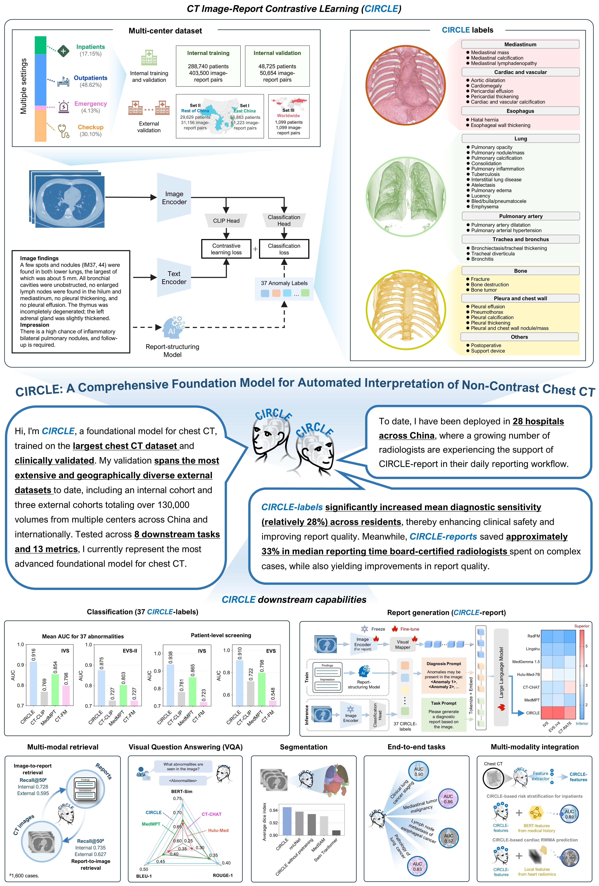

# CIRCLE


<p align="center">
    
<p>

<p align="center">
        🔥 <a href="https://huggingface.co/datasets/uii-open-source/CIRCLE-ZS20K">CIRCLE Dataset</a>&nbsp&nbsp | &nbsp&nbsp🤗 <a href="https://huggingface.co/uii-open-source/CIRCLE">CIRCLE Model</a>&nbsp&nbsp | &nbsp&nbsp📑 Paper is coming</a>&nbsp&nbsp
</p>

## Introduction

A comprehensive introduction of CIRCLE, a state-of-the-art (SOTA) thoracic CT foundation model. 

Developed through a collaboration between 15 Chinese hospitals and United Imaging Intelligence (UII), CIRCLE is presented as the first clinically validated model designed for broad-spectrum abnormality detection exclusively on non-contrast chest CT scans.

#### Key Attributes

* **Largest-scale real-world chest CT foundation training data**: 403,500 volumes from 288,740 patients, paired with free-text radiology reports.
* **Hybrid learning framework**: unified self-supervised contrastive alignment and supervised learning on 37 LLM-extracted thoracic abnormalities.
* **Strong and consistent diagnostic generalization**: validated on one internal cohort (50,654 volumes) and three external cohorts: Set I (61,223), Set II (31,156), Set III (1,099), with mean AUCs of **0.916 / 0.882 / 0.875 / 0.872**.
* **Broad downstream clinical utility**: strong transfer across zero-shot diagnosis, patient-level screening, retrieval, VQA, and competitive segmentation transfer.
* **Clinically validated human-AI collaboration**: improved diagnostic safety/quality and meaningful reporting-time reduction in radiologist workflows.
<p align="center">
  
</p>

## News
* 2025.10.11: We have released the [**CIRCLE model**](https://huggingface.co/uii-open-source/CIRCLE) (Both image and text encoder) and the partial data [**CIRCLE Dataset**](https://huggingface.co/datasets/uii-open-source/CIRCLE-ZS20K). Enjoy it!
* 2025.9.28: We have released the official PyTorch implementation for the CIRCLE foundation model.
* 2025.7.28: We introduce the CIRCLE model to the world. The CIRCLE model made its debut at [**the 8th World Artificial Intelligence Conference (WAIC 2025, Shanghai)**](https://wallstreetcn.com/articles/3751978), where it was recognized for its strong generalization, diagnostic accuracy, and potential to enhance human–AI collaboration in CT interpretation.


## Hardware Requirements
The following hardware configuration is recommended for running the open-source code:
| Component                        | Model / Specification                             |
| -------------------------------- | ------------------------------------------------- |
| **CPU**                          | Intel® Xeon® Platinum 8358 or equivalent          |
| **Memory**                       | DDR4, 1 TB or higher                              |
| **System Disk**                  | 480 GB × 2 NVMe SSD (total 960 GB)                |
| **GPU**                          | NVIDIA L40S × 8                                   |

<!-- | **Data Disk**                    | over 100 TB NVMe SSD            | -->


The system is Ubuntu 22.04 LTS, with NVIDIA driver version 535.154.05 and CUDA version 12.2 installed.

## <span id="Dataset">Dataset</span>
To facilitate future research and promote community progress in CT foundation modeling, we will make part of our CT image–report paired dataset publicly available. We randomly select 20,000 cases from our internal validation set for open release, including both images and their corresponding reports (CIRCLE-ZS20K dataset), which can be publicly accessed via 🤗 [Hugging Face](https://huggingface.co/datasets/uii-open-source/CIRCLE-ZS20K). 

The CIRCLE-ZS20K dataset is an example dataset associated with a related publication currently under submission. We plan to release a larger-scale version in the future, contingent upon obtaining additional ethical approvals and administrative permissions.

The CIRCLE collaborators place the highest priority on protecting patient privacy and interests. All personally identifiable information has been thoroughly anonymized.
At this stage, researchers must contact the CIRCLE collaborators prior to any academic publication based on this dataset. The use of the CIRCLE-ZS20K dataset for any commercial purposes is strictly prohibited.

The CIRCLE-ZS20K dataset contains two folders, and the details are shown as follows:
```
├── CIRCLE-ZS20K
│   ├── image
│   │    ├── 00001
│   │    │    ├── CT.nii.gz
│   │    ├── 00002
│   │    │    ├── CT.nii.gz
│   │    ├── ...
│   ├── label
│   │    ├── lung_center.csv
│   │    ├── CIRCLE_chest37.csv
│   │    ├── CIRCLE_chest10.csv
│   │    ├── CIRCLE_chest_screening.csv
│   ├── report
│   │    ├── report.csv
```
`CIRCLE-ZS20K/image/...` contains 20,000 sample CT scans in each subdirectory, numbered from 00001 to 20000. Each case includes a non-contrast CT image stored in the NIfTI format (CT.nii.gz). 

`CIRCLE-ZS20K/label/...` contains four CSV files:


| **File Name** | **Description** |
|----------------|-----------------|
| **`lung_center.csv`** | The first column is the image name. The next three columns represent the x, y, and z world coordinates of the crop center. In our experiments, the crop center corresponds to the center of the lungs. |
| **`CIRCLE_chest37.csv`** | The first column is the image name. The next 37 columns correspond to the labels of 37 thoracic abnormalities, automatically extracted from reports using our proposed CIRCLE-labeler. A value of 1 indicates a positive finding, while 0 indicates a negative finding. |
| **`CIRCLE_chest10.csv`** | The first column is the image name. The next 10 columns correspond to the labels of 10 abnormalities in downstream tasks, automatically extracted from reports using the CIRCLE-labeler. A value of 1 indicates a positive finding, while 0 indicates a negative finding. |
| **`CIRCLE_chest_screening.csv`** | The first column is the image name. The next column corresponds to the patient-level screening label, automatically extracted from reports using the CIRCLE-labeler. A value of 1 indicates a positive finding, while 0 indicates a negative finding. |


The file `report.csv` in `CIRCLE-ZS20K/report/...` contains structured radiology report information with three columns:
| **Column**       | **Description**                                                                                                                                                   |
| ---------------- | ----------------------------------------------------------------------------------------------------------------------------------------------------------------- |
| **`image_name`** | Identifies each case by its corresponding number *(1–20000)*.                                                                                                      |
| **`finding`**    | Describes the imaging observations in **Chinese**, including anatomical and pathological findings from non-contrast CT scans, as reviewed by senior radiologists. |
| **`impression`** | Provides the **diagnostic conclusion** in Chinese, validated by senior radiologists.                                                                              |

Here, we provide an example report from the open-source dataset, including both the findings and impression, along with their English translations.
| Field          | Chinese                                                                                                          | English Translation                                                                                                                                                                                                                                                                                                                                                                                                                                                                                                                                                                                             |
| -------------- | ---------------------------------------------------------------------------------------------------------------- | --------------------------------------------------------------------------------------------------------------------------------------------------------------------------------------------------------------------------------------------------------------------------------------------------------------------------------------------------------------------------------------------------------------------------------------------------------------------------------------------------------------------------------------------------------------------------------------------------------------- |
| **Finding**    | 左上肺舌段见类圆形肿块影，大小约65×56mm，增强后边缘强化为主，中心坏死无明显强化，病灶周围见斑片模糊影及条片状实变影；两肺少许斑点条索影，左下肺少许实变影，所见各支气管腔通畅，纵隔见轻度肿大淋巴结，左侧胸腔内少量积液。 | A round-like mass measuring approximately 65 × 56 mm is observed in the lingular segment of the left upper lobe. Post-contrast imaging shows predominantly peripheral enhancement with central necrosis demonstrating no significant enhancement. Patchy opacities and streaky consolidation are seen around the lesion. A few spotted and streaky shadows are noted in both lungs, along with areas of consolidation in the left lower lobe. The bronchial airways are patent. Mildly enlarged lymph nodes are present in the mediastinum, accompanied by a small amount of pleural effusion on the left side. |
| **Impression** | 左上肺MT伴阻塞性炎症及不张，左侧少量胸腔积液；两肺少许慢性炎症陈旧灶，左下肺少许节段性不张。                                                                  | Malignant tumor in the left upper lobe with obstructive inflammation and atelectasis; left-sided small pleural effusion; few chronic inflammatory and fibrotic changes in both lungs; segmental atelectasis in the left lower lobe.                                                                                                                                                                     

## Code Structure
- `data/`: demo data files used by training/testing examples (`vqa.json`, `lung_center.csv`, classification CSVs, etc.).
- `figures/`: figures used in this README.
- `model/`: model definitions, including `CIRCLE` (`circle.py`) and `CIRCLEReport` (`circle_report.py`).
- `train/`: training entry scripts and trainer/dataset utilities.
   - `train_circle.py`: CIRCLE (CLIP) training.
   - `train_circle_report.py`: CIRCLE-Report training.
   - `train_circle_vqa.py`: CIRCLE-VQA training.
   - `train_circle_classification.py`: CIRCLE-Clinical-Classification training.
- `test/`: inference/evaluation scripts.
   - `run_cls.py`: classification inference (current demo script outputs 4 representative classes).
   - `run_cls_prompt.py`: prompt-based zero-shot classification.
   - `run_knn.py`: KNN-based zero-shot classification / screening.
   - `run_retrieval.py`: cross-modal retrieval.
   - `run_report_generation.py`: report generation inference.
   - `run_labeler.py`: report-to-label extraction.


## Installation

### Requirements

- Python >= 3.11

### Option 1: Local Setup (Recommended for Development)

1. Clone this repository:
   ```bash
   git clone https://github.com/uii-open-source/CIRCLE
   cd CIRCLE/
   export PYTHONPATH="${PYTHONPATH}:$(pwd)"
   ```

2. Install the required dependencies (we recommend using a virtual environment):
   ```bash
   pip install -r requirements.txt
   ```
   Specific package versions are listed in `requirements.txt`.

---

### Option 2: Docker (Recommended for Quick Deployment)

We provide both a `Dockerfile` for custom builds and a pre-built image on [Docker Hub](https://hub.docker.com/r/cjh1232009/circle) for immediate use.

#### Use the pre-built image from Docker Hub (quickest start)
Pull and run the official image:
```bash
docker run --gpus all --shm-size 400G --privileged=true -it cjh1232009/circle:latest
```

#### Or build your own image locally
If you prefer to build from source:
```bash
docker build -t circle .
docker run --gpus all --shm-size 400G --privileged=true -it circle
```


> 💡 **Tip**: The pre-built image includes all dependencies and is ready to run—no need to clone the repo unless you plan to modify the code.


## Training & Evaluation by Task

### 1. CIRCLE（CLIP Model）Training

Before training `train/train_circle.py`, prepare:

1. **Text encoder init** (e.g., Chinese RoBERTa Base):
   - https://www.modelscope.cn/models/iic/nlp_roberta_backbone_base_std

   You can also initialize from the open-sourced CIRCLE text encoder for continued training on your own dataset.
   The CIRCLE text encoder has been pre-trained on over 400,000 radiology reports and is typically a stronger initialization than generic backbones.
2. **Dataset in CIRCLE-ZS20K format**:
   - image folder: `/path/to/image/<image_name>/CT.nii.gz`
   - label csv: `/path/to/label/label.csv`
   - lung center csv: `/path/to/label/lung_center.csv`
   - report csv: `/path/to/report/report.csv`
3. **Edit `train/train_circle.py`** to set:

   After downloading model/data, update local paths in `train/train_circle.py` as follows:

```python
# Initialize the BERT tokenizer and model from a pre-trained model path
tokenizer = BertTokenizer.from_pretrained('/path/to/circle/text_model/nlp_roberta_backbone_base_std')
text_encoder = BertModel.from_pretrained("/path/to/circle/text_model/nlp_roberta_backbone_base_std")

trainer = CIRCLETrainer(
    circle_model,                                     # the CIRCLE model instance
    tokenizer,                                        # tokenizer for processing text inputs
    data_folder='/path/to/image',                     # folder containing all patient CT data
    label_csv='/path/to/label/label.csv',             # CSV file mapping image names to labels
    lung_center_csv='/path/to/label/lung_center.csv', # CSV file with lung center coordinates for cropping
    report_csv='/path/to/report/report.csv',          # CSV file containing report text for each image
    num_train_steps=200001,                           # total number of training steps
    batch_size=5,                                     # batch size for training
    results_folder="/path/to/results",                # folder to save training outputs and checkpoints
    num_workers=6,                                    # number of data loader workers for parallel loading
    save_results_every=1000,                          # frequency (in steps) to save intermediate results
    save_model_every=1000                             # frequency (in steps) to save model checkpoints
)

```

   Replace `/path/to/circle/text_model/nlp_roberta_backbone_base_std` with your local text model path.
   Replace `/path/to/image`, `/path/to/label`, `/path/to/report`, and `/path/to/results` with your local dataset/output paths.

If you use your own dataset, please keep the same directory layout and CSV field definitions as CIRCLE-ZS20K (see [Dataset](#Dataset)).

Use the following command to start training.

```bash
accelerate launch --use_fsdp --mixed_precision=bf16 train/train_circle.py
```
Based on our training experience, using our hardware configuration, training the model on approximately 400,000 samples takes ～ 72 hours.

### 2. Supervised Classification with CIRCLE

We have open-sourced CIRCLE image/text encoders at:
- https://huggingface.co/uii-open-source/CIRCLE

Our supervised classification model supports 37 thoracic abnormality categories.
In this open-source release, we provide **4 representative classes** (Pulmonary nodule/mass, Cardiomegaly, Pleural effusion, Pneumothorax) classification head for reproducible testing.

Use `test/run_cls.py` for inference:

```bash
python test/run_cls.py \
  --gpu_id 0 \
  --vision_encoder_path /path/to/vision_encoder.bin \
  --text_encoder_dir /path/to/text_encoder_dir \
  --image_dir /path/to/image \
  --center_csv /path/to/lung_center.csv \
  --output_path /path/to/output
```

Arguments:
- `gpu_id`: GPU index used for inference.
- `vision_encoder_path`: path to CIRCLE vision encoder checkpoint (e.g., `vision_encoder.bin`).
- `text_encoder_dir`: path to CIRCLE text encoder directory.
- `image_dir`: root directory containing case folders (`<image_name>/CT.nii.gz`).
- `center_csv`: CSV file with crop center coordinates for each case.
- `output_path`: directory for saving prediction CSV.

After inference, the script saves `result_cls_prob.csv` under `output_path`.
The CSV contains 5 columns: `image_name` and four class probabilities.

### 3. Zero-shot Classification with CIRCLE

We evaluate two zero-shot settings with CIRCLE:
- **10-class abnormality classification** for downstream categories outside the predefined supervised classes.
- **2-class patient-level screening** (normal vs. abnormal).

For both settings, keep CT data in CIRCLE-ZS20K style (`/path/to/image/<image_name>/CT.nii.gz`) and provide the corresponding lung-center CSV.

#### 3.1 Prompt-based zero-shot

Use `run_cls_prompt.py` to classify user-defined abnormality names via text prompts.

```bash
python test/run_cls_prompt.py \
  --gpu_id 0 \
  --vision_encoder_path /path/to/vision_encoder.bin \
  --text_encoder_dir /path/to/text_encoder_dir \
  --image_dir /path/to/image \
  --center_csv /path/to/lung_center.csv \
  --abnormality_names 纵隔胸腺瘤 \
  --output_path /path/to/output
```

Arguments:
- `abnormality_names`: one or multiple abnormality names for prompt-based scoring.
- Other arguments are the same as supervised inference (`gpu_id`, model paths, image path, center CSV, output path).

Output:
- `result_prompt_cls.csv` under `output_path`.
- Columns: `image_name` + one probability column for each input abnormality name.

#### 3.2 KNN-based zero-shot (10-class)

Use `run_knn.py` with a retrieval database and 10-class labels.

```bash
python test/run_knn.py \
  --gpu_id 0 \
  --vision_encoder_path /path/to/vision_encoder.bin \
  --text_encoder_dir /path/to/text_encoder_dir \
  --knn_image_dir /path/to/knn_image \
  --knn_center_csv /path/to/knn_lung_center.csv \
  --knn_label_csv /path/to/CIRCLE_chest10.csv \
  --image_dir /path/to/test_image \
  --center_csv /path/to/test_lung_center.csv \
  --output_path /path/to/output
```

Arguments:
- `knn_image_dir`: retrieval database image root.
- `knn_center_csv`: lung-center CSV for retrieval database images.
- `knn_label_csv`: label CSV for retrieval database (set to `CIRCLE_chest10.csv` for 10-class zero-shot).
- `image_dir`, `center_csv`: test set image root and lung-center CSV.

Output:
- `result_knn_cls.csv` under `output_path`.
- Columns: `image_name` + probability columns corresponding to labels in `knn_label_csv`.

#### 3.3 KNN-based patient-level screening (2-class)

Use the same command as above, but set:
- `--knn_label_csv /path/to/CIRCLE_chest_screening.csv`

Output remains `result_knn_cls.csv`, with `image_name` and screening probability column(s) defined by the screening CSV.

### 4. Retrieval with CIRCLE

`run_retrieval.py` supports cross-modal retrieval between CT images and reports using the CIRCLE image/text encoders.
Please keep image data in CIRCLE-ZS20K style (`/path/to/image/<image_name>/CT.nii.gz`) and provide matching lung-center CSV and report CSV.

```bash
python test/run_retrieval.py \
  --gpu_id 0 \
  --vision_encoder_path /path/to/vision_encoder.bin \
  --text_encoder_dir /path/to/text_encoder_dir \
  --image_dir /path/to/test_image \
  --center_csv /path/to/test_lung_center.csv \
  --report_csv /path/to/report.csv \
  --type image_to_report \
  --recall_num 5 \
  --output_path /path/to/output
```

Arguments:
- `gpu_id`: GPU index used for inference.
- `vision_encoder_path`: path to CIRCLE vision encoder checkpoint.
- `text_encoder_dir`: path to CIRCLE text encoder directory.
- `image_dir`: root directory containing case folders (`<image_name>/CT.nii.gz`).
- `center_csv`: CSV file with crop center coordinates for each image.
- `report_csv`: report file matched by `image_name` (the script reads `finding` and `impression`).
- `type`: retrieval direction, supports `image_to_report` and `report_to_image`.
- `recall_num`: top-K retrieval size.
- `output_path`: directory for retrieval results.

Output:
- `result_retrieval_@<recall_num>.csv` under `output_path`.
- Columns include `recall@1 ... recall@K` and `image_name` (query sample id).

### 5. CIRCLE-Report

CIRCLE-Report is the report generation module built on CIRCLE visual features and a Qwen3-8B language model.
The training script uses LoRA-based fine-tuning and expects image/report paired data.

#### 5.1 Training

`train/train_circle_report.py` uses hard-coded local paths. Before launch, update local paths and training parameters as follows:

```python
# Path to Qwen3-8B model
llm_cache_dir = "/path/to/Qwen3-8B"

# Path to pre-trained vision encoder
pretrained_vision_encoder_path = "/path/to/vision_encoder.bin"

trainer = CIRCLETrainer(
   circle_report_model,                               # The model to be trained
   train_gpt=True,                                    # Flag to enable training of the GPT component
   data_folder='/path/to/image',                      # folder containing all patient CT data
   label_csv='/path/to/label/label.csv',              # CSV file mapping image names to labels
   lung_center_csv='/path/to/label/lung_center.csv',  # CSV file with lung center coordinates for cropping
   report_csv='/path/to/report/report.csv',           # CSV file containing report text for each image
   lr=2e-5,                                           # Learning rate for training
   max_grad_norm=1.0,                                 # Maximum gradient norm for clipping
   batch_size=3,                                      # Number of samples per training batch
   num_train_steps=200001,                            # Total number of training steps
   num_workers=6,                                     # Number of worker processes for data loading
   save_results_every=1500,                           # Frequency of saving intermediate results
   save_model_every=10,                               # Frequency of saving model checkpoints
   results_folder="/path/to/report_results",          # Directory to save training results
)
```

Replace all `/path/to/...` with your local paths.

Then launch:

```bash
accelerate launch --mixed_precision=bf16 train/train_circle_report.py
```

#### 5.2 Testing

Use `run_report_generation.py` to generate reports from image + predicted labels:

```bash
python test/run_report_generation.py \
   --image_dir /path/to/image \
   --lung_center_csv /path/to/lung_center.csv \
   --predict_label_csv /path/to/predict_label.csv \
   --output_csv /path/to/report_generation_output.csv \
   --gpu_id 0 \
   --llm_model_path /path/to/Qwen3-8B \
   --vision_encoder_path /path/to/vision_encoder.bin \
   --visual_mapper_path /path/to/visual_mapper.bin
```

We provide demo data under `data/` for quick testing, including:
- `data/image`
- `data/lung_center.csv`
- `data/predict_label.csv`

You can run testing directly with default arguments:

```bash
python test/run_report_generation.py \
   --gpu_id 0 \
   --llm_model_path /path/to/Qwen3-8B \
   --vision_encoder_path "" \
   --visual_mapper_path ""
```

Arguments:
- `image_dir`: image root directory (`<image_name>/CT.nii.gz`).
- `lung_center_csv`: crop center CSV for each image.
- `predict_label_csv`: predicted label CSV (must include `image_name`; remaining columns are used as label indicators).
- `output_csv`: output file path for generated reports.
- `llm_model_path`: local path or model id for finetuned Qwen3-8B.
- `vision_encoder_path`, `visual_mapper_path`: optional checkpoint paths for visual modules.

Output:
- A CSV at `output_csv`, containing `image_name` and `report_generation`.

`vision_encoder_path` and `visual_mapper_path` checkpoints are not open-sourced in this repository.
If `vision_encoder_path` / `visual_mapper_path` is set to `""` (or file not found), the script skips loading them.
In this case, visual module parameters are randomly initialized, so generated results are random and should be used only for pipeline/functionality verification.

### 6. CIRCLE-VQA

CIRCLE-VQA follows the same vision-language pipeline as CIRCLE-Report, but supervises the model with image-question-answer triplets.

#### 6.1 Dataset Format

The VQA annotation file should be a JSON dictionary mapping each `image_name` to a list of QA pairs, for example:

```json
{
   "image1": [
      {"question": "图像中存在哪些异常？", "answer": "肺部炎症，支气管扩张"},
      {"question": "图像存在肺部炎症吗？", "answer": "存在"}
   ],
   "image2": [
      {"question": "图像中存在哪些异常？", "answer": "无"}
   ]
}
```

The corresponding CT files should be organized as:

```text
/path/to/image/<image_name>/CT.nii.gz
```

#### 6.2 Training

`train/train_circle_vqa.py` uses hard-coded local paths. Before launch, update local paths and training parameters as follows:

```python
# Path to Qwen3-8B model
llm_cache_dir = "/path/to/Qwen3-8B"

# Path to pre-trained vision encoder
pretrained_vision_encoder_path = "/path/to/vision_encoder.bin"

trainer = CIRCLETrainer(
         circle_report_model,
         train_gpt=True,
         data_folder='/path/to/image',
         vqa_json='/path/to/vqa.json',
         lung_center_csv='/path/to/lung_center.csv',
         lr=2e-5,
         max_grad_norm=1.0,
         batch_size=1,
         num_train_steps=200001,
         num_workers=6,
         save_results_every=1500,
         save_model_every=10,
         results_folder="/path/to/vqa_results",
)
```

Replace all `/path/to/...` with your local paths.

Then launch:

```bash
accelerate launch --mixed_precision=bf16 train/train_circle_vqa.py
```

For demo data in this repo, you can directly use:
- `data_folder='data/image'`
- `vqa_json='data/vqa.json'`
- `lung_center_csv='data/lung_center.csv'`

### 7. CIRCLE-Segmentation

CIRCLE-Segmentation is implemented on top of nnUNet with an EffNet-based encoder adaptation.
Related files in this repository are under `model/segmentation/`.

#### 7.1 Installation of nnUNet-2.3.1

- GitHub repository: https://github.com/MIC-DKFZ/nnUNet

#### 7.2 Environment Variable Setup

Set nnUNet required environment variables before preprocessing/training/inference:

```bash
export nnUNet_raw="/path/to/nnUNet_raw"
export nnUNet_results="/path/to/nnUNet_results"
export nnUNet_preprocessed="/path/to/nnUNet_preprocessed"
```

#### 7.3 EffNet Adaptation (File Modifications)

After installing nnUNet, copy CIRCLE segmentation files into the nnUNet codebase:

- Create `nnunetv2/Networks/` and place `model/segmentation/segmodel.py` as `nnunetv2/Networks/segmodel.py`.
- Replace `nnunetv2/inference/predict_from_raw_data.py` with `model/segmentation/predict_from_raw_data.py`.
- Place `model/segmentation/nnUNetTrainerNoDeepSupervision.py` into `nnunetv2/training/nnUNetTrainer/variants/network_architecture/nnUNetTrainerNoDeepSupervision.py`.

#### 7.4 Training

To load pre-trained weights, set `model_pt_path` in `EffNet3DEncoderForSeg` inside `segmodel.py`.

Then launch training:

```bash
nnUNetv2_train [Dataset ID] 3d_fullres 0 -tr nnUNetTrainerNoDeepSupervision
```

#### 7.5 Inference

Run inference with:

```bash
nnUNetv2_predict -i [Input Folder] -o [Output Folder] -d [Dataset ID] -c 3d_fullres -f 0 -chk [Model Path] -tr nnUNetTrainerNoDeepSupervision
```

### 8. Clinical Classification Task with CIRCLE

This module trains a supervised clinical classification model on CT images.

Prepare train/validation CSV with columns:

```text
image_path,lung_center_world_x,lung_center_world_y,lung_center_world_z,label
```

Field description:
- `image_path`: absolute or relative path to CT image (e.g., `/path/to/image_xxx/CT.nii.gz`).
- `lung_center_world_x/y/z`: world-coordinate crop center used during preprocessing.
- `label`: class index.

Launch training:

```bash
python train/train_circle_classification.py \
   --task_type lung_stage \
   --num_class 4 \
   --train_data_csv /path/to/train.csv \
   --val_data_csv /path/to/val.csv \
   --save_dir /path/to/save_dir
```

Arguments:
- `task_type`: task name used in logging/experiment folder naming.
- `num_class`: number of classes.
- `train_data_csv`, `val_data_csv`: training/validation CSV paths.
- `save_dir`: root directory for logs and checkpoints.

Optional args: `--device_ids`, `--lr`, `--optm_type`, `--batch_size`, `--weight_decay`, `--total_epoch`, `--log_interval`.

Output:
- Training logs are saved under `save_dir`.
- Checkpoints are saved under `save_dir/.../checkpoints/`.

## CIRCLE-Labeler

`CIRCLE-Labeler` is the report-to-label extraction module in this repository.

### Model Note

- The current labeler model is obtained by fine-tuning **Qwen3-1.7B** on approximately **400,000** chest CT report samples.
- The model has been open-sourced at: [https://huggingface.co/uii-open-source/CIRCLE](https://huggingface.co/uii-open-source/CIRCLE)

### Usage

Run label extraction with a CSV containing a `report` column:

```bash
python test/run_labeler.py \
   --model_name /path/to/labeler_model \
   --report_text_csv /path/to/report_text.csv \
   --output_csv /path/to/output_label.csv \
   --gpu_id 0
```

Quick start (use built-in input and default output path):

```bash
python test/run_labeler.py \
   --model_name /path/to/labeler_model \
   --gpu_id 0
```

Arguments:
- `model_name`: local model path or model id.
- `report_text_csv`: input CSV path.
- `output_csv`: output CSV path.
- `gpu_id`: GPU index used for inference.

Default behavior:
- If `--report_text_csv` is omitted, the script uses `data/report_text_test.csv`.
- If `--output_csv` is omitted, the script saves to `output/label.csv`.

### Input / Output Format

- Input CSV (`report_text_csv`): must contain a column named `report`.
- Output CSV (`output_csv`): contains `report`, `label`, and 37 binary label columns.

## License
All components of CIRCLE, including the released models and datasets, are made available under the [Creative Commons Attribution–NonCommercial–ShareAlike (CC-BY-NC-SA) license](https://creativecommons.org/licenses/by-nc-sa/4.0/).
This licensing framework allows free use of our work for non-commercial research purposes, while ensuring that:
- Proper attribution is given to the original work.
- Any modifications or derivative works are distributed under the same license terms.
- Commercial use of the released models or datasets is not permitted without explicit authorization.
