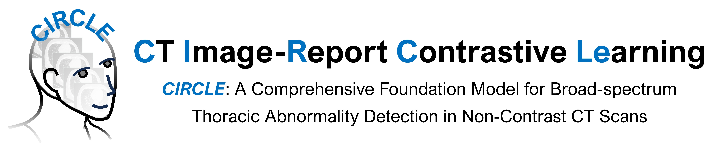

# CIRCLE


<p align="center">
    
<p>
<p align="center">
    
<p>

<p align="center">
        💜 <a href="https://huggingface.co/datasets/uii-open-source/CIRCLE-ZS2K"><b>CIRCLE Dataset</b></a>&nbsp&nbsp | &nbsp&nbsp🤗 <a href="https://huggingface.co/xxx">CIRCLE Model</a>&nbsp&nbsp | &nbsp&nbsp📑 Paper is coming</a>&nbsp&nbsp
</p>

## Introduction

A comprehensive introduction of CIRCLE, a state-of-the-art (SOTA) thoracic CT foundation model. 

Developed through a collaboration between eight Chinese hospitals and United Imaging Intelligence (UII), CIRCLE is presented as the first clinically validated model designed for broad-spectrum abnormality detection exclusively on non-contrast chest CT scans.

#### Key Attributes:

* **Large-scale Dataset**: The model is created to address the limitations of contrast-enhanced CT and traditional supervised learning, leveraging **~400,000  real-world clinical image-report pairs**. ​​
* **Unsurpervised Image-report Alignment**:​​ The core architecture is based on a vision-language pre-training approach that uses contrastive learning to align CT image features with corresponding radiology report text. ​
* **SOTA Performance**:​ CIRCLE demonstrates high competence in automatically extracting labels for 37 abnormalities from unstructured reports (F1-score: 0.99) and achieves state-of-the-art performance in population-level screening (Image-wise Volume-wise Curve - Area Under the Curve, IVC-AUC: 0.938). 
* **Clinical Validation**:​​ Clinical validation shows that CIRCLE effectively collaborates with radiology residents, reducing diagnostic errors and improving reading efficiency.
<p align="center">
  
</p>

## News
* 2025.10.11: We have released the [**CIRCLE model**](https://huggingface.co/xxx) (Both image and text encoder) and the partial data [**CIRCLE Dataset**](https://huggingface.co/datasets/uii-open-source/CIRCLE-ZS2K). Enjoy it!
* 2025.9.28: We have released the official PyTorch implementation for the CIRCLE foundation model.
* 2025.7.28: We introduce the CIRCLE model to the world. The CIRCLE model made its debut at [**the 8th World Artificial Intelligence Conference (WAIC 2025, Shanghai)**](https://wallstreetcn.com/articles/3751978), where it was recognized for its strong generalization, diagnostic accuracy, and potential to enhance human–AI collaboration in CT interpretation.


## Hardware Requirements
The following hardware configuration is recommended for running the open-source code:
| Component                        | Model / Specification                             |
| -------------------------------- | ------------------------------------------------- |
| **CPU**                          | Intel® Xeon® Platinum 8358 or equivalent          |
| **Memory**                       | DDR4, 1 TB or higher                              |
| **System Disk**                  | 480 GB × 2 NVMe SSD (total 960 GB)                |
| **GPU**                          | NVIDIA L40S × 8                                   |

<!-- | **Data Disk**                    | over 100 TB NVMe SSD            | -->
<!-- | **GPU**                          | NVIDIA L40S × 8                                   | -->

The system is Ubuntu 22.04 LTS, with NVIDIA driver version 535.154.05 and CUDA version 12.2 installed.

## Dataset
To facilitate future research and promote community progress in CT foundation modeling, we will make part of our CT image–report paired dataset publicly available. We randomly select 2,000 cases from our internal validation set for open release, including both images and their corresponding reports (CIRCLE-ZS2K dataset), which can be publicly accessed via 🤗 [Hugging Face](https://huggingface.co/datasets/uii-open-source/CIRCLE-ZS2K). 

The CIRCLE-ZS2K dataset is an example dataset associated with a related publication currently under submission. We plan to release a larger-scale version in the future, contingent upon obtaining additional ethical approvals and administrative permissions.

The CIRCLE collaborators place the highest priority on protecting patient privacy and interests. All personally identifiable information has been thoroughly anonymized.
At this stage, researchers must contact the CIRCLE collaborators prior to any academic publication based on this dataset. The use of the CIRCLE-ZS2K dataset for any commercial purposes is strictly prohibited.

The CIRCLE-ZS2K dataset contains two folders, and the details are shown as follows:
```
├── CIRCLE-ZS2K
│   ├── image
│   │    ├── 0001
│   │    │    ├── CT.nii.gz
│   │    ├── 0002
│   │    │    ├── CT.nii.gz
│   │    ├── ...
│   ├── report
│   │    ├── report.csv
│   ├── label
│   │    ├── CIRCLE_chest37.csv
│   │    ├── CIRCLE_chest2.csv
│   │    ├── lung_center.csv
```
`CIRCLE-ZS2K/image/...` contains 2,000 sample CT scans in each subdirectory, numbered from 0001 to 2000. Each case includes a non-contrast CT image stored in the NIfTI format (CT.nii.gz). 

The file `report.csv` contains structured radiology report information with three columns:
| **Column**       | **Description**                                                                                                                                                   |
| ---------------- | ----------------------------------------------------------------------------------------------------------------------------------------------------------------- |
| **`image_name`** | Identifies each case by its corresponding number *(1–2000)*.                                                                                                      |
| **`finding`**    | Describes the imaging observations in **Chinese**, including anatomical and pathological findings from non-contrast CT scans, as reviewed by senior radiologists. |
| **`impression`** | Provides the **diagnostic conclusion** in Chinese, validated by senior radiologists.                                                                              |

Here, we provide an example report（*Index 0002*）from the open-source dataset, including both the findings and impression, along with their English translations.
| Field          | Chinese                                                                                                          | English Translation                                                                                                                                                                                                                                                                                                                                                                                                                                                                                                                                                                                             |
| -------------- | ---------------------------------------------------------------------------------------------------------------- | --------------------------------------------------------------------------------------------------------------------------------------------------------------------------------------------------------------------------------------------------------------------------------------------------------------------------------------------------------------------------------------------------------------------------------------------------------------------------------------------------------------------------------------------------------------------------------------------------------------- |
| **Finding**    | 左上肺舌段见类圆形肿块影，大小约65×56mm，增强后边缘强化为主，中心坏死无明显强化，病灶周围见斑片模糊影及条片状实变影；两肺少许斑点条索影，左下肺少许实变影，所见各支气管腔通畅，纵隔见轻度肿大淋巴结，左侧胸腔内少量积液。 | A round-like mass measuring approximately 65 × 56 mm is observed in the lingular segment of the left upper lobe. Post-contrast imaging shows predominantly peripheral enhancement with central necrosis demonstrating no significant enhancement. Patchy opacities and streaky consolidation are seen around the lesion. A few spotted and streaky shadows are noted in both lungs, along with areas of consolidation in the left lower lobe. The bronchial airways are patent. Mildly enlarged lymph nodes are present in the mediastinum, accompanied by a small amount of pleural effusion on the left side. |
| **Impression** | 左上肺MT伴阻塞性炎症及不张，左侧少量胸腔积液；两肺少许慢性炎症陈旧灶，左下肺少许节段性不张。                                                                  | Malignant tumor in the left upper lobe with obstructive inflammation and atelectasis; left-sided small pleural effusion; few chronic inflammatory and fibrotic changes in both lungs; segmental atelectasis in the left lower lobe.                                                                                                                                                                     

## Code Structure
- `figures/`: figures in README.
- `model/`: main CIRCLE model combining image and text encoders for multi-modal learning.
- `train/`: training codes for CIRCLE model.

## Installation
Clone this repo.
```bash
git clone https://github.com/uii-open-source/CIRCLE
cd CIRCLE/
```
Please install dependencies (e.g., pytorch, transformers) by
```bash
pip install -r requirements.txt
```
The specific types and versions of the required software can be found in the `requirements.txt` file. 


## Training
### data prepare
